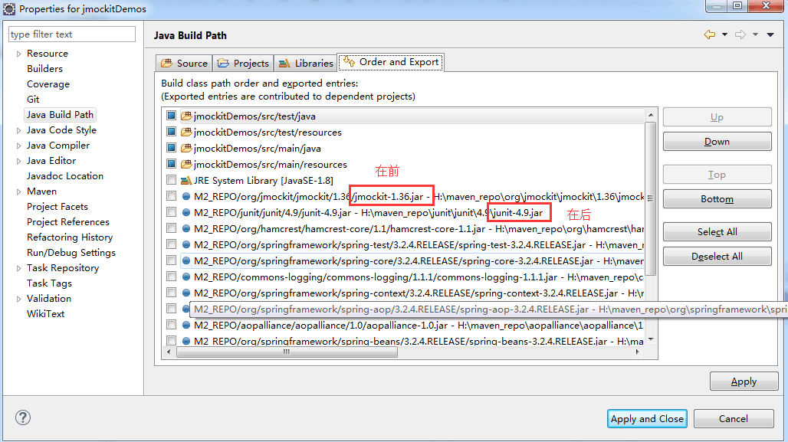
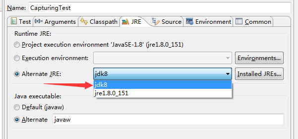
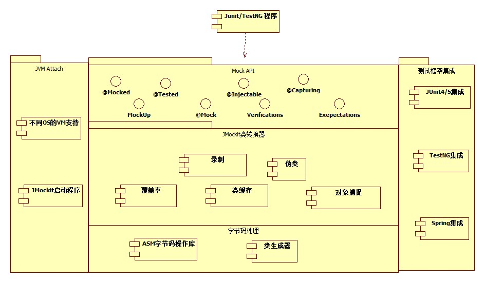
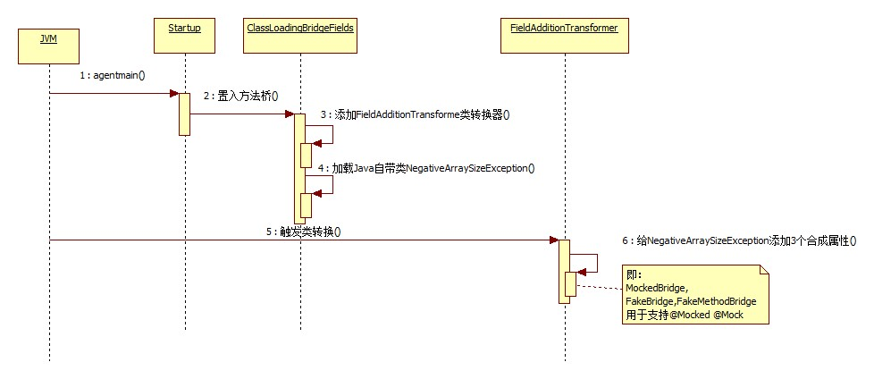

# Jmockit简介

## JMockit是什么？

JMockit是一款Java类/接口/对象的Mock工具，目前广泛应用于Java应用程序的单元测试中。  

## 为什么要学习JMockit？

首先，不会测试的不是好开发，不会Mock的不是好测试。因而，不会Mock的不是好开发。

当然，Java Mock工具很多，比如easyMock,Mockito等等。为什么要选择JMockit呢？其实也没有啥特别原因，Mock工具的原理都差不多，就看Mock工具封装的API是否易用了。JMockit的API易用，丰富！ 写出来的Mock程序代码完全面向对象。 那我们就先来看一小段JMockit测试程序，先睹为快吧！

```java
//一个简单的类，能用不同语言打招呼
public class HelloJMockit {
    // 向JMockit打招呼
    public String sayHello() {
        Locale locale = Locale.getDefault();
        if (locale.equals(Locale.CHINA)) {
            // 在中国，就说中文
            return "你好，JMockit!";
        } else {
            // 在其它国家，就说英文
            return "Hello，JMockit!";
        }
    }
}
//HelloJMockit类的测试类
public class HelloJMockitTest { 
 
    /**
     * 测试场景：当前是在中国
     */
    @Test
    public void testSayHelloAtChina() {
        // 假设当前位置是在中国
        new Expectations(Locale.class) {
            {
                Locale.getDefault();
                result = Locale.CHINA;
            }
        };
        // 断言说中文
        Assert.assertTrue("你好，JMockit!".equals((new HelloJMockit()).sayHello()));
    }
 
    /**
     * 测试场景：当前是在美国
     */
    @Test
    public void testSayHelloAtUS() {
        // 假设当前位置是在美国
        new Expectations(Locale.class) {
            {
                Locale.getDefault();
                result = Locale.US;
            }
        };
        // 断言说英文
        Assert.assertTrue("Hello，JMockit!".equals((new HelloJMockit()).sayHello()));
    }
}

```

在上面的例子中，为了对依赖（当前的位置）进行Mock，用简单的3行代码即可搞定。把测试代码的依赖抽象成期待(Expectations)，并把期待类Expectations作为本测试程序的内部类，可以任意访问本测试程序类的所有成员，为编写Mock程序提供极大便利。API面向对象特性封装良好。

此外，JMockit还提供了注解，支持泛型的Mock API用于对类/对象的属性，方法(支持static,private,final,native)，构造函数，初始代码块(含静态初始代码块)灵活Mock。

可以说，JMockit是一款功能强大，API易用，不可或缺的Java Mock工具。

## 学习JMockit的先决条件

Java基础，写过JUnit/TestNG程序 

# Jmockit基础

1.在Maven pom.xml配置 

```xml
 <dependency>
    <groupId>org.jmockit</groupId>
    <artifactId>jmockit</artifactId>
    <version>1.36</version>
    <scope>test</scope>
  </dependency>
```

2.JUnit4.x及以下用户特别注意事项

如果你是通过mvn test来运行你的测试程序 , 请确保JMockit的依赖定义出现在JUnit的依赖之前。  

```xml
<!-- 先声明jmockit的依赖 -->
   <dependency>
    <groupId>org.jmockit</groupId>
    <artifactId>jmockit</artifactId>
    <version>1.36</version>
    <scope>test</scope>
  </dependency>
<!-- 再声明junit的依赖 -->
   <dependency>
    <groupId>junit</groupId>
    <artifactId>junit</artifactId>
    <version>4.9</version>
    <scope>test</scope>
  </dependency>
```

如果你是在Eclipse中运行/调试你的测试程序， 需要确保JMockit出现在JUnit之前。你可以提供Up,Down来调整。 

- 


3.JMockit Coverage配置 

   如果你还需要使用JMockit的代码覆盖率功能，你需要在Maven pom.xml中如下定义  

```xml
 <plugin>
     <artifactId>maven-surefire-plugin</artifactId>
    <configuration>
    <argLine>-javaagent:"${settings.localRepository}/org/jmockit/jmockit/1.36/jmockit-1.36.jar=coverage"</argLine>
    <disableXmlReport>false</disableXmlReport>
    <systemPropertyVariables>
    <coverage-output>html</coverage-output>
    <coverage-outputDir>${project.build.directory}/codecoverage-output</coverage-outputDir>
    <coverage-metrics>all</coverage-metrics>
    </systemPropertyVariables>
    </configuration>
 </plugin>
```

4.常见错误
java.lang.IllegalStateException: Native library for Attach API not available in this JRE

Caused by: java.lang.UnsatisfiedLinkError: no attach in java.library.path

   遇到这种情况，你是用JRE来跑测试程序的，需要切换成JDK才可以。




# Jmockit常见用法

## mock类

再讲述如何Mock类之前，我们先给出一个普通的类，这个类有static,final,native,private方法。以及一个非static/final/native/private的普通public 方法。  

```java
//一个普通类 
public class AnOrdinaryClass {
 
    // 静态方法
    public static int staticMethod() {
        return 1;
    }
 
    // 普通方法
    public int ordinaryMethod() {
        return 2;
    }
 
    // final方法
    public final int finalMethod() {
        return 3;
    }
 
    // native方法,返回4
    public native int navtiveMethod();
 
    // private方法
    private int privateMethod() {
        return 5;
    }
 
    // 调用private方法
    public int callPrivateMethod() {
        return privateMethod();
    }
}
```

下面，讲述2种Mock类的方法

1.用Expectations来Mock。

```java
 //用Expectations来mock类
public class ClassMockingByExpectationsTest {
 
    @Test
    public void testClassMockingByExpectation() {
        AnOrdinaryClass instanceToRecord = new AnOrdinaryClass();
        new Expectations(AnOrdinaryClass.class) {
            {
                // mock静态方法
                AnOrdinaryClass.staticMethod();
                result = 10;
                // mock普通方法
                instanceToRecord.ordinaryMethod();
                result = 20;
                // mock final方法
                instanceToRecord.finalMethod();
                result = 30;
                // native, private方法无法用Expectations来Mock
            }
        };
        AnOrdinaryClass instance = new AnOrdinaryClass();
        Assert.assertTrue(AnOrdinaryClass.staticMethod() == 10);
        Assert.assertTrue(instance.ordinaryMethod() == 20);
        Assert.assertTrue(instance.finalMethod() == 30);
        // 用Expectations无法mock native方法
        Assert.assertTrue(instance.navtiveMethod() == 4);
        // 用Expectations无法mock private方法
        Assert.assertTrue(instance.callPrivateMethod() == 5);
    }
 
    @BeforeClass    
    // 加载AnOrdinaryClass类的native方法的native实现    
    public static void loadNative() throws Throwable {    
        JNITools.loadNative();    
    }    
}
```

2.用MockUp来Mock类 

```java
//用MockUp来mock类
public class ClassMockingByMockUpTest {
    // AnOrdinaryClass的MockUp类，继承MockUp即可
    public static class AnOrdinaryClassMockUp extends MockUp<AnOrdinaryClass> {
        // Mock静态方法
        @Mock
        public static int staticMethod() {
            return 10;
        }
 
        // Mock普通方法
        @Mock
        public int ordinaryMethod() {
            return 20;
        }
 
        @Mock
        // Mock final方法
        public final int finalMethod() {
            return 30;
        }
 
        // Mock native方法
        @Mock
        public int navtiveMethod() {
            return 40;
        }
 
        // Mock private方法
        @Mock
        private int privateMethod() {
            return 50;
        }
    }
 
    @Test
    public void testClassMockingByMockUp() {
        new AnOrdinaryClassMockUp();
        AnOrdinaryClass instance = new AnOrdinaryClass();
        // 静态方法被mock了
        Assert.assertTrue(AnOrdinaryClass.staticMethod() == 10);
        // 普通方法被mock了
        Assert.assertTrue(instance.ordinaryMethod() == 20);
        // final方法被mock了
        Assert.assertTrue(instance.finalMethod() == 30);
        // native方法被mock了
        Assert.assertTrue(instance.navtiveMethod() == 40);
        // private方法被mock了
        Assert.assertTrue(instance.callPrivateMethod() == 50);
    }
 
    @BeforeClass    
    // 加载AnOrdinaryClass类的native方法的native实现    
    public static void loadNative() throws Throwable {    
        JNITools.loadNative();    
    }    
}
```


## Mock实例

在Mock类的章节中，我们知道了如何用Expectations来Mock类。Mock实例的用法基本一样。只需要把Expectations的构造函数参数换成实例即可。

用Expectations来Mock类与用Expectations来Mock实例的唯一不同就在于，前者影响类的所有实例，而后者只影响某一个实例。

```java
//mock实例
public class InstanceMockingByExpectationsTest {
    @Test
    public void testInstanceMockingByExpectation() {
        AnOrdinaryClass instance = new AnOrdinaryClass();
        // 直接把实例传给Expectations的构造函数即可Mock这个实例
        new Expectations(instance) {
            {
                // 尽管这里也可以Mock静态方法，但不推荐在这里写。静态方法的Mock应该是针对类的
                // mock普通方法
                instance.ordinaryMethod();
                result = 20;
                // mock final方法
                instance.finalMethod();
                result = 30;
                // native, private方法无法用Expectations来Mock
            }
        };
        Assert.assertTrue(AnOrdinaryClass.staticMethod() == 1);
        Assert.assertTrue(instance.ordinaryMethod() == 20);
        Assert.assertTrue(instance.finalMethod() == 30);
        // 用Expectations无法mock native方法
        Assert.assertTrue(instance.navtiveMethod() == 4);
        // 用Expectations无法mock private方法
        Assert.assertTrue(instance.callPrivateMethod() == 5);
    }
 
    @BeforeClass    
    // 加载AnOrdinaryClass类的native方法的native实现    
    public static void loadNative() throws Throwable {    
        JNITools.loadNative();    
    }    
}
```

## Mock接口

在讲述如何Mock接口前，我们给出一个普通接口的代码。 

```java
//一个普通的接口
public interface AnOrdinaryInterface {
    // 方法1
    public int method1();
 
    // 方法2
    public int method2();
}
```

我们依然给出2种Mock接口的2种方法。  

1.用Expectations来Mock 

```java
//用Expectations来mock接口
public class InterfaceMockingByExpectationsTest {
 
    // 通过@Injectable，让JMockit帮我们生成这个接口的实例，
    // 一般来说，接口是给类来依赖的，我们给待测试的类加上@Tested，就可以让JMockit做依赖注入。详细见JMockit基础的章节
    @Injectable
    AnOrdinaryInterface anOrdinaryInterface;
 
    @Test
    public void testInterfaceMockingByExpectation() {
        // 录制
        new Expectations() {
            {
                anOrdinaryInterface.method1();
                result = 10;
                anOrdinaryInterface.method2();
                result = 20;
            }
        };
        Assert.assertTrue(anOrdinaryInterface.method1() == 10);
        Assert.assertTrue(anOrdinaryInterface.method2() == 20);
    }
}
```

2.用MockUp来Mock 

```java
//用MockUp来mock接口
public class InterfaceMockingByMockUpTest {
 
    @Test
    public void testInterfaceMockingByMockUp() {
        // 手工通过MockUp创建这个接口的实例
        AnOrdinaryInterface anOrdinaryInterface = new MockUp<AnOrdinaryInterface>(AnOrdinaryInterface.class) {
            // 对方法Mock
            @Mock
            public int method1() {
                return 10;
            }
 
            @Mock
            public int method2() {
                return 20;
            }
        }.getMockInstance();
 
        Assert.assertTrue(anOrdinaryInterface.method1() == 10);
        Assert.assertTrue(anOrdinaryInterface.method2() == 20);
    }
}
```

显然， 在Mock接口时，使用@Injectable注解API，比使用MockUp更方便。单纯通过MockUp生成接口的某个Mock实例，在实际的测试场景中并没有多大用途，接口就是用来给类依赖的，我们要充分利用JMockit的依赖注入功能。

 ## Mock Spring Bean

如今，我们的很多应用程序是基于Spring的，通过Spring IOC容器来管理我们的Java对象。所以这里单独提出对Spring Bean如何Mock方法。

以上述提到[如何Mock类](http://jmockit.cn/showArticle.htm?id=2)中的提到的AnOrdinaryClass为例，先把这个类配置在Spring的配置文件中

```xml
<?xml version="1.0" encoding="utf-8"?>
<!--suppress ALL -->
<beans xmlns="http://www.springframework.org/schema/beans"
    xmlns:xsi="http://www.w3.org/2001/XMLSchema-instance" xmlns:context="http://www.springframework.org/schema/context"
    xmlns:aop="http://www.springframework.org/schema/aop" xmlns:tx="http://www.springframework.org/schema/tx"
    xmlns:p="http://www.springframework.org/schema/p"
    xsi:schemaLocation="http://www.springframework.org/schema/beans
        http://www.springframework.org/schema/beans/spring-beans-2.5.xsd
        http://www.springframework.org/schema/context
        http://www.springframework.org/schema/context/spring-context-2.5.xsd
        http://www.springframework.org/schema/tx http://www.springframework.org/schema/tx/spring-tx-2.0.xsd
        http://www.springframework.org/schema/aop http://www.springframework.org/schema/aop/spring-aop-2.0.xsd"
    default-autowire="byName">
 
   <!-- 1个普通的spring bean-->
    <bean id="anOrdinaryBean" class="cn.jmockit.demos.AnOrdinaryClass" /> 
 
</beans>
```


同样地，讲述2种Mock方法

1.用Expectations来Mock

```java
//用Expectations来Mock Spring Bean
@ContextConfiguration(locations = { "/META-INF/applicationContext1.xml" })
@RunWith(SpringJUnit4ClassRunner.class)
public class SpringBeanMockingByExpectationsTest {
    // 注入Spring Bean，Mock这个实例，就达到了Mock Spring Bean的目的
    @Resource
    AnOrdinaryClass anOrdinaryBean;
 
    @Test
    public void testSpringBeanMockingByExpectation() {
        // 直接把实例传给Expectations的构造函数即可Mock这个实例
        new Expectations(anOrdinaryBean) {
            {
                // 尽管这里也可以Mock静态方法，但不推荐在这里写。静态方法的Mock应该是针对类的
                // mock普通方法
                anOrdinaryBean.ordinaryMethod();
                result = 20;
                // mock final方法
                anOrdinaryBean.finalMethod();
                result = 30;
                // native, private方法无法用Expectations来Mock
            }
        };
        Assert.assertTrue(AnOrdinaryClass.staticMethod() == 1);
        Assert.assertTrue(anOrdinaryBean.ordinaryMethod() == 20);
        Assert.assertTrue(anOrdinaryBean.finalMethod() == 30);
        // 用Expectations无法mock native方法
        Assert.assertTrue(anOrdinaryBean.navtiveMethod() == 4);
        // 用Expectations无法mock private方法
        Assert.assertTrue(anOrdinaryBean.callPrivateMethod() == 5);
    }
 
    @BeforeClass    
    // 加载AnOrdinaryClass类的native方法的native实现    
    public static void loadNative() throws Throwable {    
        JNITools.loadNative();    
    }    
}
```

2.用MockUp来Mock 

```java
//用MockUp来Mock Spring Bean
@ContextConfiguration(locations = { "/META-INF/applicationContext1.xml" })
@RunWith(SpringJUnit4ClassRunner.class)
public class SpringBeanMockingByMockUpTest {
    // 注入Spring Bean，Mock这个实例，就达到了Mock Spring Bean的目的
    @Resource
    AnOrdinaryClass anOrdinaryBean;
 
    @Test
    public void testSpringBeanMockingByMockUp() {
        // 静态方法被mock了
        Assert.assertTrue(AnOrdinaryClass.staticMethod() == 10);
        // 普通方法被mock了
        Assert.assertTrue(anOrdinaryBean.ordinaryMethod() == 20);
        // final方法被mock了
        Assert.assertTrue(anOrdinaryBean.finalMethod() == 30);
        // native方法被mock了
        Assert.assertTrue(anOrdinaryBean.navtiveMethod() == 40);
        // private方法被mock了
        Assert.assertTrue(anOrdinaryBean.callPrivateMethod() == 50);
    }
 
    @BeforeClass
    public static void beforeClassMethods() throws Throwable {
        loadNative();
        // 必须在Spring容器初始化前，就对Spring Bean的类做MockUp
        addMockUps();
    }
 
         
    // 加载AnOrdinaryClass类的native方法的native实现    
    public static void loadNative() throws Throwable {    
        JNITools.loadNative();    
    }    
 
    // 对AnOrdinaryClass的Class
    public static class AnOrdinaryClassMockUp extends MockUp<AnOrdinaryClass> {
        // Mock静态方法
        @Mock
        public static int staticMethod() {
            return 10;
        }
 
        // Mock普通方法
        @Mock
        public int ordinaryMethod() {
            return 20;
        }
 
        @Mock
        // Mock final方法
        public final int finalMethod() {
            return 30;
        }
 
        // Mock native方法
        @Mock
        public int navtiveMethod() {
            return 40;
        }
 
        // Mock private方法
        @Mock
        private int privateMethod() {
            return 50;
        }
    }
 
    // 添加MockUp
    public static void addMockUps() {
        new AnOrdinaryClassMockUp();
    }
}
```

## Mock Dubbo 消费bean

Dubbo是我们常用的RPC框架，在写单元测试需要调用Dubbo消费Bean时，如何模拟Dubbo消费Bean的行为呢？

   就拿发邮件来说，通常，在代码中，我们是调用邮件的Dubbo服务来完成发送邮件的目的，于是我们会在Spring配置好的发邮件的Dubbo消费Bean,
dubbo-consumer.xml

```xml
<?xml version="1.0" encoding="utf-8"?>
<beans xmlns="http://www.springframework.org/schema/beans"
    xmlns:xsi="http://www.w3.org/2001/XMLSchema-instance"
    xmlns:dubbo="http://dubbo.apache.org/schema/dubbo"
    xsi:schemaLocation="http://www.springframework.org/schema/beans        
    http://www.springframework.org/schema/beans/spring-beans-4.3.xsd        
    http://dubbo.apache.org/schema/dubbo        
    http://dubbo.apache.org/schema/dubbo/dubbo.xsd">
 
    <dubbo:application name="consumer-of-dubbo-mock-test" />
 
    <dubbo:registry address="zookeeper://your-zk-address:2181" />
    <!-- 生成远程服务代理，可以和本地bean一样使用mailService -->
    <dubbo:reference id="mailService" interface="cn.jmockit.demos.MailService" />
</beans>
```

熟悉Dubbo的朋友都知道，上面xml配置是Dubbo的基本配置，配置了dubbo服务的zookeeper地址，还配置了名叫mailService的Dubbo消费Bean，用于在应用程序中发送邮件。
   我们在运行单元测试时，如果zookeeper连不上或者mailService的服务提供者不存在，则会导致Spring初始化失败， 而且我们也不希望真正发送邮件（除非是为了测试发送邮件）。于是我们希望对mailService进行Mock。
  下面给出一种Mock Dubbo消费Bean的方案：

1.在spring初始化前，对所有Dubbo消费Bean的进行Mock，即<dubbo>标签里的interface都返回本地默认实现。

2.如果想对某几个Dubbo消费Bean进行Mock，则自定义Dubbo消费Bean的实现即可。

   请看测试代码：  

```java
//dubbo消费bean Mock 
@SuppressWarnings({ "unchecked", "rawtypes" })
@ContextConfiguration(locations = { "/META-INF/dubbo-consumer.xml" })
@RunWith(SpringJUnit4ClassRunner.class)
public class DubboConsumerBeanMockingTest {
    // 这里要@BeforeClass,因为要抢在spring加载dubbo前，对dubbo的消费工厂bean
    // ReferenceBean进行mock，不然dubbo可能因为连上不zk或无法找不
    // 服务的提供者等原因而无法初始化的，进而，单元测试运行不下去
    @BeforeClass
    public static void mockDubbo() {
        // 你准备mock哪个消费bean
        // 比如要对dubbo-consumber.xml里配置的cn.jmockit.demos.MailService这个消费bean进行mock
        Map<String, Object> mockMap = new HashMap<String, Object>();
        mockMap.put("cn.jmockit.demos.MailService", new MockUp(MailService.class) {
            // 在这里书写对这个消费bean进行mock的mock逻辑，想mock哪个方法，就自行添加，注意方法一定要加上@Mock注解哦
            @Mock
            public boolean sendMail(long userId, String content) {
                // 单元测试时，不需要调用邮件服务器发送邮件，这里统一mock邮件发送成功
                return true;
            }
        }.getMockInstance());
        // 如果要Mock其它的消费bean，自行添加,mockMap.put.....如上
        new DubboConsumerBeanMockUp(mockMap);
    }
 
    // 现在你使用的dubbo消费bean就是本地mock过的了，并不是指向远程dubbo服务的bean了
    @Resource
    MailService mailService;
 
    @Test
    public void testSendMail() {
        long userId = 123456;
        String content = "test mail content";
        Assert.isTrue(mailService.sendMail(userId, content));
    }
}
```

上述代码，最关键的就是DubboConsumerBeanMockUp类了，这个类Mock了所有的Dubbo消费Bean.     源代码如下： 

```java
//dubbo消费bean的MockUp(伪类）
@SuppressWarnings("rawtypes")
public class DubboConsumerBeanMockUp extends MockUp<ReferenceBean> {
    // 自定义的消费bean mock对象
    private Map<String, Object> mockMap;
 
    public DubboConsumerBeanMockUp() {
    }
 
    public DubboConsumerBeanMockUp(Map<String, Object> mockMap) {
        this.mockMap = mockMap;
    }
 
    // 对ReferenceBean的getObject方法的Mock
    @SuppressWarnings("unchecked")
    @Mock
    public Object getObject(Invocation inv) throws Exception {
        ReferenceBean ref = inv.getInvokedInstance();
        String interfaceName = ref.getInterface();
        Object mock = mockMap.get(interfaceName);
        if (mock != null) {
            return mock;
        }
        return (new MockUp(Class.forName(interfaceName)) {
        }).getMockInstance();
    }
}
```


## Mock MQ消息生产者

RocketMQ是我们常用的消息中间件，在运行单元测试时，我们可能不需要真正发送消息（除非是为了测试发送消息），也不想因为连结不上RocketMQ的Broker,NameServer而影响单元测试运行。    那我们该如何Mock RocketMQ消息生产者呢？   请看例子： 

```java
//RocketMQ消息生产者 Mock 
 
public class RocetMQProducerMockingTest {
    // 把RocketMQ的生产者mock
    @BeforeClass
    public static void mockRocketMQ() {
        new RocketMQProducerMockUp();
    }
 
    @Test
    public void testSendRocketMQMessage() throws Exception {
        DefaultMQProducer producer = new DefaultMQProducer("test_producer");
        producer.setNamesrvAddr("192.168.0.2:9876;192.168.0.3:9876");
        producer.start();
        for (int i = 0; i < 20; i++) {
            Message msg = new Message("testtopic", "TagA", ("Hello " + i).getBytes());
            // 因为mq生产者已经mock,所以消息并不会真正的发送，即使nameServer连不上，也不影响单元测试的运行
            SendResult result = producer.send(msg);
            Assert.isTrue(result.getSendStatus() == SendStatus.SEND_OK);
            Assert.isTrue(result.getMsgId() != null);
        }
        producer.shutdown();
    }
}
```

最关键的类是RocketMQProducerMockUp，这个类改变了生产者默认实现。代码如下：  

```java
//MQ消息发送者 的MockUp(伪类） 
public class RocketMQProducerMockUp extends MockUp<DefaultMQProducer> {
 
    @Mock
    void init() throws MQClientException {
        // 构造函数也什么都不做
    }
 
    @Mock
    void start() throws MQClientException {
        // 启动，什么都不做 
    }
 
    @Mock
    void shutdown() {
        // 关闭，也什么都不做 
    }
 
    @Mock
    List<MessageQueue> fetchPublishMessageQueues(final String topic) throws MQClientException {
        // 欺骗调用方，返回不存在的消息队列，因为消息并不会真正发送嘛
        List<MessageQueue> queues = new ArrayList<MessageQueue>();
        MessageQueue q = new MessageQueue();
        q.setBrokerName("testbrokername");
        q.setQueueId(1);
        q.setTopic("testtopic");
        queues.add(q);
        return queues;
    }
 
    // 下面是对各个send方法的mock,都返回消息成功结果
    @Mock
    SendResult send(final Message msg)
            throws MQClientException, RemotingException, MQBrokerException, InterruptedException {
        return newSuccessSendResult();
    }
 
    @Mock
    SendResult send(final Message msg, final long timeout)
            throws MQClientException, RemotingException, MQBrokerException, InterruptedException {
        return newSuccessSendResult();
    }
 
    @Mock
    void send(final Message msg, final SendCallback sendCallback)
            throws MQClientException, RemotingException, InterruptedException {
        sendCallback.onSuccess(this.newSuccessSendResult());
    }
 
    @Mock
    void send(final Message msg, final SendCallback sendCallback, final long timeout)
            throws MQClientException, RemotingException, InterruptedException {
        sendCallback.onSuccess(this.newSuccessSendResult());
    }
 
    @Mock
    void sendOneway(final Message msg) throws MQClientException, RemotingException, InterruptedException {
 
    }
 
    @Mock
    SendResult send(final Message msg, final MessageQueue mq)
            throws MQClientException, RemotingException, MQBrokerException, InterruptedException {
        return newSuccessSendResult();
    }
 
    @Mock
    SendResult send(final Message msg, final MessageQueue mq, final long timeout)
            throws MQClientException, RemotingException, MQBrokerException, InterruptedException {
        return newSuccessSendResult();
    }
 
    @Mock
    void send(final Message msg, final MessageQueue mq, final SendCallback sendCallback)
            throws MQClientException, RemotingException, InterruptedException {
        sendCallback.onSuccess(this.newSuccessSendResult());
    }
 
    @Mock
    void send(final Message msg, final MessageQueue mq, final SendCallback sendCallback, long timeout)
            throws MQClientException, RemotingException, InterruptedException {
        sendCallback.onSuccess(this.newSuccessSendResult());
    }
 
    @Mock
    void sendOneway(final Message msg, final MessageQueue mq)
            throws MQClientException, RemotingException, InterruptedException {
 
    }
 
    @Mock
    SendResult send(final Message msg, final MessageQueueSelector selector, final Object arg)
            throws MQClientException, RemotingException, MQBrokerException, InterruptedException {
        return newSuccessSendResult();
    }
 
    @Mock
    SendResult send(final Message msg, final MessageQueueSelector selector, final Object arg, final long timeout)
            throws MQClientException, RemotingException, MQBrokerException, InterruptedException {
        return newSuccessSendResult();
    }
 
    @Mock
    void send(final Message msg, final MessageQueueSelector selector, final Object arg, final SendCallback sendCallback)
            throws MQClientException, RemotingException, InterruptedException {
        sendCallback.onSuccess(this.newSuccessSendResult());
    }
 
    @Mock
    void send(final Message msg, final MessageQueueSelector selector, final Object arg, final SendCallback sendCallback,
            final long timeout) throws MQClientException, RemotingException, InterruptedException {
        sendCallback.onSuccess(this.newSuccessSendResult());
    }
 
    @Mock
    void sendOneway(final Message msg, final MessageQueueSelector selector, final Object arg)
            throws MQClientException, RemotingException, InterruptedException {
 
    }
 
    @Mock
    TransactionSendResult sendMessageInTransaction(final Message msg, final LocalTransactionExecuter tranExecuter,
            final Object arg) throws MQClientException {
        return newTransactionSendResult();
    }
 
    private TransactionSendResult newTransactionSendResult() {
        TransactionSendResult success = new TransactionSendResult();
        success.setSendStatus(SendStatus.SEND_OK);
        success.setMsgId(UUID.randomUUID().toString());
        MessageQueue q = new MessageQueue();
        q.setBrokerName("testbrokername");
        q.setQueueId(1);
        q.setTopic("testtopic");
        success.setMessageQueue(q);
        success.setLocalTransactionState(LocalTransactionState.COMMIT_MESSAGE);
        return success;
    }
 
    private SendResult newSuccessSendResult() {
        SendResult success = new SendResult();
        success.setSendStatus(SendStatus.SEND_OK);
        success.setMsgId(UUID.randomUUID().toString());
        MessageQueue q = new MessageQueue();
        q.setBrokerName("testbrokername");
        q.setQueueId(1);
        q.setTopic("testtopic");
        success.setMessageQueue(q);
        return success;
    }
}
```

## 用Jmockit做代码覆盖率

说到代码覆盖率，你肯定会想到Jacoco， 其实JMockit相比Jacoco，做代码覆盖率，一样很强大。如果你关心代码的路径覆盖率，JMockit有，而Jacoco没有！ 

  那我们该如何配置JMockit做覆盖率呢？很简单，只需要在pom.xml给surefire(即mvn test背后的maven插件)配置一些参数即可。
    在pom.xml中<project><build><plugins>节点给插件surefire增加一些参数即可。

```xml
<plugin>
       <artifactId>maven-surefire-plugin</artifactId>
    <version>2.20</version>
    <configuration>
    <disableXmlReport>true</disableXmlReport>
    <argLine>-Dcoverage-metrics=all</argLine>
    </configuration>
</plugin>
```

执行mvn test后呢？去哪里看覆盖率呢？  target/coverage-report目录下，用浏览器找开index.html，就可以看了。

​    JMockit给我们提供的行覆盖率，路径覆盖率，数据覆盖率。
    行覆盖率是从代码行的维度进行统计，哪些行被测试到了，本文不做详细介绍了。
    数据覆盖率是指一个类的哪些非静态属性被修改过了，这个不常用，指导意义也不大。本文也不做详细介绍了。
    本文重点介绍一下，JMockit的路径覆盖率和Jacoco的分支覆盖率，这2个是非常容易混淆的概念。
    咱们先拿几个简单的类来做测试，并分别看其JMockit的路径覆盖率结果，Jacoco的分支覆盖率结果。
   比如要测试这个简单的类，

```java
//打招呼的接口
public interface ISayHello {
    // 性别：男
    int MALE = 0;
    // 性别：女
    int FEMALE = 1;
 
    /**
     * 打招呼
     * 
     * @param who    向谁说
     * @param gender 对方的性别
     * @return 返回打招呼的内容
     */
    String sayHello(String who, int gender);
 
    /**
     * 向多个人打招呼
     * 
     * @param who    向谁说
     * @param gender 对方的性别
     * @return 返回向多个人打招呼的内容
     */
    List<String> sayHello(String[] who, int[] gender);
 
}
 
 
 
public class SayHello implements ISayHello {
    @Override
    public String sayHello(String who, int gender) {
        // 性别校验
        if (gender != FEMALE) {
            if (gender != MALE) {
                throw new IllegalArgumentException("illegal gender");
            }
        }
        // 根据不同性别，返回不同打招呼的内容
        switch (gender) {
        case FEMALE:
            return "hello Mrs " + who; 
        case MALE:
            return "hello Mr " + who;
        default:
            return "hello  " + who;
        }
    }
 
    @Override
    public List<String> sayHello(String[] who, int[] gender) {
        // 参数校验
        if (who == null || gender == null) {
            return null;
        }
        if (who.length != gender.length) {
            throw new IllegalArgumentException();
        }
        //把向每个人打招呼的内容，保存到result中。
        List<String> result = new ArrayList<String>();
        for (int i = 0; i < gender.length; i++) {
            result.add(this.sayHello(who[i], gender[i]));
        }
        return result;
    }
 
}
```

上面2个类，一个是接口，另一个是实现该接口的类。 类的功能十分简单，就是向别人打招呼。  假设现在我们要测试SayHello这个类。

测试代码如下：

```java
//代码覆盖率测试，观察覆盖率的计算方式,去target/coverage-report目录下，查看SayHello这个类的覆盖率
public class CodeCoverageTest {
    ISayHello sayHello = new SayHello();
 
    @Rule
    public ExpectedException thrown = ExpectedException.none();
 
    //测试 sayHello(String who, int gender);
    @Test
    public void testSayHello1() {
        Assert.isTrue(sayHello.sayHello("david", ISayHello.MALE).equals("hello Mr david"));
        Assert.isTrue(sayHello.sayHello("lucy", ISayHello.FEMALE).equals("hello Mrs lucy"));
        thrown.expect(IllegalArgumentException.class);
        sayHello.sayHello("david", 3);
    }
    //测试 sayHello(String[] who, int[] gender)
    @Test
    public void testSayHello2() {
        String[] who = new String[] { "david", "lucy" };
        int[] gender = new int[] { ISayHello.MALE, ISayHello.FEMALE };
        List<String> result = sayHello.sayHello(who, gender);
        Assert.isTrue(result.get(0).equals("hello Mr david"));
        Assert.isTrue(result.get(1).equals("hello Mrs lucy"));
    }
 
}
```

# JMockit高级用法

## Mock构造函数&初始代码块

有时候，有些编写不良好的类的构造函数，初始代码块，静态代码块存在大量的初始化逻辑，初始化会报错。

比如，有些类初始化的时候就去连结DB，连不上就报错。这很影响我们的测试程序的运行。

此时，我们需要把这些初始化逻辑Mock掉。用我们的Mock逻辑替代。要Mock这些初始化代码，很简单。见如下的例子：

```java
//一个包含初始代码块的普通类 
public class AnOrdinaryClassWithBlock {
    private int i;
 
    public static int j;
 
    // 初始代码块
    {
        i = 1;
    }
    // 静态初始代码块
    static {
        j = 2;
    }
 
    // 构造函数
    public AnOrdinaryClassWithBlock(int i) {
        this.i = i;
    }
  
    public int getI() {
        return i;
    }
 
    public void setI(int i) {
        this.i = i;
    }
 
}

//Mock构造函数&初始代码块
public class ConstructorAndBlockMockingTest {
    // AnOrdinaryClassWithBlock的MockUp类，继承MockUp即可
    public static class AnOrdinaryClassWithBlockMockUp extends MockUp<AnOrdinaryClassWithBlock> {
        // Mock构造函数和初始代码块, 函数名$init就代表类的构造函数
        @Mock
        public void $init(int i) {
        }
 
        // Mock静态初始代码块,, 函数名$init就代表类的静态代码块
        @Mock
        public void $clinit() {
        }
    }
 
    @Test
    public void testClassMockingByMockUp() {
        new AnOrdinaryClassWithBlockMockUp();
        AnOrdinaryClassWithBlock instance = new AnOrdinaryClassWithBlock(10);
        // 静态初始代码块被mock了
        Assert.assertTrue(AnOrdinaryClassWithBlock.j == 0);
        // 构造函数和初始代码块被mock
        Assert.assertTrue(instance.getI() == 0);
    }
 
}
```

## Mock一类多实例

@Mocked太狠了，把类的所有的实例都Mock了。有时候我们希望一个类不同的实例有不同的Mock逻辑，怎么呢？

下面列举3种方法。还是以[如何Mock类](http://jmockit.cn/showArticle.htm?id=2)中的提到的AnOrdinaryClass为例。

```java
//一个类多个实例的Mock 
public class OneClassManyInstanceMockingTest {
    // Mock方法一: 把实例传入Expectations的构造函数。适用场景： 只Mock实例的部分方法，对实例的类的其它实例不产生影响
    @Test
    public void testMocking1() {
        AnOrdinaryClass instance1 = new AnOrdinaryClass();
        AnOrdinaryClass instance2 = new AnOrdinaryClass();
        // 直接把实例传给Expectations的构造函数即可Mock这个实例
        new Expectations(instance1, instance2) {
            {
                instance1.ordinaryMethod();
                result = 20;
                instance2.ordinaryMethod();
                result = 200;
            }
        };
        AnOrdinaryClass instance3 = new AnOrdinaryClass();
        // instance1的ordinaryMethod被Mock了
        Assert.assertTrue(instance1.ordinaryMethod() == 20);
        // instance2的ordinaryMethod被Mock了
        Assert.assertTrue(instance2.ordinaryMethod() == 200);
        // instance3不受影响。
        Assert.assertTrue(instance3.ordinaryMethod() == 2);
    }
    // Mock方法二: 用@Mocked。适用场景： 类的所实例都需要Mock，但不同实例也能保留不同的Mock逻辑
    @Test
    public void testMocking2(@Mocked AnOrdinaryClass instance1, @Mocked AnOrdinaryClass instance2) {
        new Expectations() {
            {
                instance1.ordinaryMethod();
                result = 20;
                instance2.ordinaryMethod();
                result = 200;
            }
        };
        AnOrdinaryClass instance3 = new AnOrdinaryClass();
        // instance1的ordinaryMethod被Mock了
        Assert.assertTrue(instance1.ordinaryMethod() == 20);
        // instance2的ordinaryMethod被Mock了
        Assert.assertTrue(instance2.ordinaryMethod() == 200);
        // instance3受@Mock的影响。@Mock会把类的所有方法都Mock，返回类型为基本数据类型的返回0
        Assert.assertTrue(instance3.ordinaryMethod() == 0);
    }
    // Mock方法二: 用@Injectable。适用场景： 不是类的所实例都需要Mock，不同实例也能保留不同的Mock逻辑
    @Test
    public void testMocking3(@Injectable AnOrdinaryClass instance1, @Injectable AnOrdinaryClass instance2) {
        new Expectations() {
            {
                instance1.ordinaryMethod();
                result = 20;
                instance2.ordinaryMethod();
                result = 200;
            }
        };
        AnOrdinaryClass instance3 = new AnOrdinaryClass();
        // instance1的ordinaryMethod被Mock了
        Assert.assertTrue(instance1.ordinaryMethod() == 20);
        // instance2的ordinaryMethod被Mock了
        Assert.assertTrue(instance2.ordinaryMethod() == 200);
        // instance3不受@Injectable的影响。因为@Injectable只影响某个实例
        Assert.assertTrue(instance3.ordinaryMethod() == 2);
    }
 
}
```

## Mock泛型(类型变量)

在JMockit基础知识中，我们学过可以用@Capturing用于对某个类或接口未来的实例进行Mock。

这里也可以利用MockUp的泛型(类型变量)Mock功能，一样可以达到某个类或接口未来的实例进行Mock的效果。只不过，我们可以享受

在MockUp中手工写Mock方法更直接的Mock方式。

以[如何Mock接口](http://www.jmockit.cn/showArticle.htm?channel=3&id=11)中的AnOrdinaryInterface为例：

```java
//Mock泛型
public class GenericMockUpTest {
    @Test
    public <T extends AnOrdinaryInterface> void testMockUp() {
        // 通过传给MockUp一个泛型类型变量，MockUp可以对这个类型变量的上限进行Mock，以后所有这个上限的方法调用，就会走Mock后的逻辑
        new MockUp<T>() {
            @Mock
            public int method1() {
                return 10;
            }
 
            @Mock
            public int method2() {
                return 20;
            }
        };
        // 自定义一个AnOrdinaryInterface的实现
        AnOrdinaryInterface instance1 = new AnOrdinaryInterface() {
            @Override
            public int method1() {
                return 1;
            }
 
            @Override
            public int method2() {
                return 1;
            }
        };
        // 再定义一个AnOrdinaryInterface的实现
        AnOrdinaryInterface instance2 = new AnOrdinaryInterface() {
            @Override
            public int method1() {
                return 2;
            }
 
            @Override
            public int method2() {
 
                return 2;
            }
        };
        // 发现自定义的实现没有被作用，而是被Mock逻辑替代了
        Assert.assertTrue(instance1.method1() == 10);
        Assert.assertTrue(instance2.method1() == 10);
        Assert.assertTrue(instance1.method2() == 20);
        Assert.assertTrue(instance2.method2() == 20);
    }
 
    // 其实用@Capturing也是一样的效果
    @Test
    public <T extends AnOrdinaryInterface> void sameEffect(@Capturing AnOrdinaryInterface instance) {
        new Expectations() {
            {
                instance.method1();
                result = 10;
                instance.method2();
                result = 20;
            }
        };
        // 自定义一个AnOrdinaryInterface的实现
        AnOrdinaryInterface instance1 = new AnOrdinaryInterface() {
            @Override
            public int method1() {
                return 1;
            }
 
            @Override
            public int method2() {
                return 1;
            }
        };
        // 再定义一个AnOrdinaryInterface的实现
        AnOrdinaryInterface instance2 = new AnOrdinaryInterface() {
            @Override
            public int method1() {
                return 2;
            }
 
            @Override
            public int method2() {
 
                return 2;
            }
        };
        // 发现自定义的实现没有被作用，而是被Mock逻辑替代了
        Assert.assertTrue(instance1.method1() == 10);
        Assert.assertTrue(instance2.method1() == 10);
        Assert.assertTrue(instance1.method2() == 20);
        Assert.assertTrue(instance2.method2() == 20);
    }
}
```

## Mock方法中调用老方法

通过前面对MockUp介绍 ，使用，我们发现MockUp确实很强大。使用@Mock方法太直接了。

可是有时候 ，你只希望@Mock的方法当入参数满足特定条件下才走Mock逻辑，其它条件走老的逻辑。可以吗？

当然可以！看下面的例子：

```java
//Mock方法中还可以调用老方法
public class InvocationMockUpTest {
    @Test
    public void testMockUp() {
        // 对Java自带类Calendar的get方法进行定制
        new MockUp<Calendar>(Calendar.class) {
            // 申明参数invocation，表示老方法的调用
            @Mock
            public int get(Invocation invocation, int unit) {
                // 只希望时间是早上7点
                if (unit == Calendar.HOUR_OF_DAY) {
                    return 7;
                }
                // 其它时间（年份，月份，日，分，秒均不变)
                return invocation.proceed(unit);
            }
        };
        Calendar now = Calendar.getInstance();
        // 只有小时变成Mock方法
        Assert.assertTrue(now.get(Calendar.HOUR_OF_DAY) == 7);
        // 其它的还是走老的方法
        Assert.assertTrue(now.get(Calendar.MONTH) == (new Date()).getMonth());
        Assert.assertTrue(now.get(Calendar.DAY_OF_MONTH) == (new Date()).getDate());
    }
 
}
```

## 同一方法调用返回时序结果

 有时候，我们需要对同一方法调用时，返回结果为一个时序结果：即同一个方法的调用，返回值不同。

​         比如，应用程序中有通过tcp/http连结外部网络操作，写单元测试时，不希望应用程序真正连结外部网络（因为可能会连结失败），因此需要对外部网络的tcp/http数据流返回数据进行mock。

​      下面直接用代码，来描述如何mock.

```java
//同一方法返回时序结果
public class ReturnSequenceResultInOneMethodTest {
    // 一个类所有实例的某个方法，返回时序结果。
    // 适用场景：每次调用，期望返回的数据不一样。比如从tcp数据流中拿数据
    @Test
    public void testIfMethodOfClass() {
        AnOrdinaryClass instance = new AnOrdinaryClass();
        new Expectations(AnOrdinaryClass.class) {
            {
                instance.ordinaryMethod();
                // 对类AnOrdinaryClass所有实例调用ordinaryMethod方法时，依次返回1，2，3，4，5
                result = new int[] { 1, 2, 3, 4, 5 };
            }
        };
        AnOrdinaryClass instance1 = new AnOrdinaryClass();
        Assert.assertTrue(instance1.ordinaryMethod() == 1);
        Assert.assertTrue(instance1.ordinaryMethod() == 2);
        Assert.assertTrue(instance1.ordinaryMethod() == 3);
        Assert.assertTrue(instance1.ordinaryMethod() == 4);
        Assert.assertTrue(instance1.ordinaryMethod() == 5);
        // 因为在上面录制脚本中，只录制了5个结果，当大于5时，就以最后一次结果为准
        Assert.assertTrue(instance1.ordinaryMethod() == 5);
        Assert.assertTrue(instance1.ordinaryMethod() == 5);
    }
 
    // 与上述不一样的地方，仅仅是对某一个实例的返回值进行录制
    @Test
    public void testIfMethodOfIntance() {
        AnOrdinaryClass instance = new AnOrdinaryClass();
        new Expectations(instance) {
            {
                instance.ordinaryMethod();
                // 对实例instance调用ordinaryMethod方法时，依次返回1，2，3，4，5
                result = new int[] { 1, 2, 3, 4, 5 };
            }
        };
        // 只影响了instance这个实例
        Assert.assertTrue(instance.ordinaryMethod() == 1);
        Assert.assertTrue(instance.ordinaryMethod() == 2);
        Assert.assertTrue(instance.ordinaryMethod() == 3);
        Assert.assertTrue(instance.ordinaryMethod() == 4);
        Assert.assertTrue(instance.ordinaryMethod() == 5);
        // 因为在上面录制脚本中，只录制了5个结果，当大于5时，就以最后一次结果为准
        Assert.assertTrue(instance.ordinaryMethod() == 5);
        Assert.assertTrue(instance.ordinaryMethod() == 5);
 
        // 类AnOrdinaryClass的其它实例并不会受到影响
        AnOrdinaryClass instance1 = new AnOrdinaryClass();
        // ordinaryMethod这个方法本来就返回2
        Assert.assertTrue(instance1.ordinaryMethod() == 2);
        Assert.assertTrue(instance1.ordinaryMethod() == 2);
    }
 
    // 下面以对tcp数据流返回数据为例子，进行mock
    @Test
    public void testInputStreamSequence() {
        try {
            // 依据地址创建URL
            URL url = new URL("http://jmockit.cn");
            // 获得urlConnecion
            URLConnection connection = url.openConnection();
            // 打开连接
            connection.connect();
            InputStream in = connection.getInputStream();
            //现在对jmockit.cn服务器返回的数据进行mock
            new Expectations(in) {
                {
                    in.read();
                    // -1表示流数据结束了
                    result = new int[] { 1, 2, 3, 4, 5, -1 };
                }
            };
            // 读取jmockit.cn服务器返回的内容，如果没有上面的mock,返回将是实际的内容
            Assert.assertTrue(in.read() == 1);
            Assert.assertTrue(in.read() == 2);
            Assert.assertTrue(in.read() == 3);
            Assert.assertTrue(in.read() == 4);
            Assert.assertTrue(in.read() == 5);
            Assert.assertTrue(in.read() == -1);
            in.close();
        } catch (Exception e) {
            e.printStackTrace();
        }
    }
}
```

## 定制返回结果

在学习Expectations([API:Expectations](http://www.jmockit.cn/showArticle.htm?channel=2&id=8))时   ，在new Expectations{{}}代码中，返回的结果都比较简单。就是一个单一的对象。可是有时，这个返回的结果，可能是需要经历一些业务逻辑计算后，才知道返回什么的，此时，我们就需要定制返回结果了。

​    还是上例子吧。

​    还是以上文打招呼的例子来说。

```java
//打招呼的接口
public interface ISayHello {
    // 性别：男
    int MALE = 0;
    // 性别：女
    int FEMALE = 1;
 
    /**
     * 打招呼
     * 
     * @param who    向谁说
     * @param gender 对方的性别
     * @return 返回打招呼的内容
     */
    String sayHello(String who, int gender);
 
    /**
     * 向多个人打招呼
     * 
     * @param who    向谁说
     * @param gender 对方的性别
     * @return 返回向多个人打招呼的内容
     */
    List<String> sayHello(String[] who, int[] gender);
 
}
 
 
 
public class SayHello implements ISayHello {
    @Override
    public String sayHello(String who, int gender) {
        // 性别校验
        if (gender != FEMALE) {
            if (gender != MALE) {
                throw new IllegalArgumentException("illegal gender");
            }
        }
        // 根据不同性别，返回不同打招呼的内容
        switch (gender) {
        case FEMALE:
            return "hello Mrs " + who; 
        case MALE:
            return "hello Mr " + who;
        default:
            return "hello  " + who;
        }
    }
 
    @Override
    public List<String> sayHello(String[] who, int[] gender) {
        // 参数校验
        if (who == null || gender == null) {
            return null;
        }
        if (who.length != gender.length) {
            throw new IllegalArgumentException();
        }
        //把向每个人打招呼的内容，保存到result中。
        List<String> result = new ArrayList<String>();
        for (int i = 0; i < gender.length; i++) {
            result.add(this.sayHello(who[i], gender[i]));
        }
        return result;
    }
 
}
```

 测试时，如果想根据入参，返回结果的内容，怎么办呢？  

```java
// 定制返回结果
public class DeletgateResultTest {
    @SuppressWarnings("rawtypes")
    @Test
    public void testDelegate() {
        new Expectations(SayHello.class) {
            {
                SayHello instance = new SayHello();
                instance.sayHello(anyString, anyInt);
                result = new Delegate() {
                    // 当调用sayHello(anyString, anyInt)时，返回的结果就会匹配delegate方法，
                    // 方法名可以自定义，当入参和返回要与sayHello(anyString, anyInt)匹配上
                    @SuppressWarnings("unused")
                    String delegate(Invocation inv, String who, int gender) {
                        // 如果是向动物鹦鹉Polly问好，就说hello,Polly
                        if ("Polly".equals(who)) {
                            return "hello,Polly";
                        }
                        // 其它的入参，还是走原有的方法调用
                        return inv.proceed(who, gender);
                    }
                };
 
            }
        };
 
        SayHello instance = new SayHello();
        Assert.isTrue(instance.sayHello("david", ISayHello.MALE).equals("hello Mr david"));
        Assert.isTrue(instance.sayHello("lucy", ISayHello.FEMALE).equals("hello Mrs lucy"));
        Assert.isTrue(instance.sayHello("Polly", ISayHello.FEMALE).equals("hello,Polly"));
    }
}
```

## 在Mock时做aop

    在学习MockUp([API:MockUp](http://www.jmockit.cn/showArticle.htm?channel=2&id=9)%E6%97%B6))时， MockUp可以自定义方法体，覆盖类原有的方法。 JMockit给我们提供了一个特别的方法，用于拦截所有方法，可以让我们在基于被Mock的方法做AOP。 比如我们想测试每个方法的时间性能。 

```java
//通过在mock时做AOP测试方法的时间性能
public class MethodCostPerformanceTest {
 
    // 测试SayHello类每个方法的时间性能
    @Test
    public void testSayHelloCostPerformance() {
        // 把方法的调用时间记录到costMap中。key是方法名称，value是平均调用时间
        Map<String, Long> costMap = new HashMap<String, Long>();
        new MockUp<SayHello>() {
            @Mock
            public Object $advice(Invocation invocation) {
                long a = System.currentTimeMillis();
                Object result = invocation.proceed();
                long cost = System.currentTimeMillis() - a;
                // 把某方法的平均调用时间记录下来
                String methodName = invocation.getInvokedMember().getName();
                Long preCost = costMap.get(methodName);
                if (preCost == null) {
                    costMap.put(methodName, cost);
                } else {
                    costMap.put(methodName, (preCost + cost) / 2);
                }
                return result;
            }
        };
        SayHello sayHello = new SayHello();
        sayHello.sayHello("david", ISayHello.MALE);
        sayHello.sayHello("lucy", ISayHello.FEMALE);
        for (Iterator<String> iterator = costMap.keySet().iterator(); iterator.hasNext();) {
            String methodName = (String) iterator.next();
            // 期望每个方法的调用时间不超过20ms
            Assert.isTrue(costMap.get(methodName) < 20);
        }
    }
 
}
```

 ## 级联mock

```java
//级联Mock:对Mock对象的方法返回再进行Mock
public class CascadingMockTest {
 
    @Test
    public void testCascading() {
        //下面以Mock  EntityManager.createNativeQuery的返回对象为例
        EntityManager entityManager = new MockUp<EntityManager>() {
            @Mock
            public Query createNativeQuery(String sqlString) {
                //返回一个自定义Query的匿名内部类就可以
                return new Query() {
                    @Override
                    public List getResultList() {
                        //在这里书写你的Mock逻辑，
                        // mock的返回数据
                        List<Object> mockResult = new ArrayList<Object>();
                        mockResult.add(new Object());
                        mockResult.add(new Object());
                        return mockResult;
                    }
 
                    @Override
                    public Object getSingleResult() {
                        // TODO Auto-generated method stub
                        return null;
                    }
 
                    @Override
                    public int executeUpdate() {
                        // TODO Auto-generated method stub
                        return 0;
                    }
 
                    @Override
                    public Query setMaxResults(int maxResult) {
                        // TODO Auto-generated method stub
                        return null;
                    }
 
                    @Override
                    public Query setFirstResult(int startPosition) {
                        // TODO Auto-generated method stub
                        return null;
                    }
 
                    @Override
                    public Query setHint(String hintName, Object value) {
                        // TODO Auto-generated method stub
                        return null;
                    }
 
                    @Override
                    public Query setParameter(String name, Object value) {
                        // TODO Auto-generated method stub
                        return null;
                    }
 
                    @Override
                    public Query setParameter(String name, Date value, TemporalType temporalType) {
                        // TODO Auto-generated method stub
                        return null;
                    }
 
                    @Override
                    public Query setParameter(String name, Calendar value, TemporalType temporalType) {
                        // TODO Auto-generated method stub
                        return null;
                    }
 
                    @Override
                    public Query setParameter(int position, Object value) {
                        // TODO Auto-generated method stub
                        return null;
                    }
 
                    @Override
                    public Query setParameter(int position, Date value, TemporalType temporalType) {
                        // TODO Auto-generated method stub
                        return null;
                    }
 
                    @Override
                    public Query setParameter(int position, Calendar value, TemporalType temporalType) {
                        // TODO Auto-generated method stub
                        return null;
                    }
 
                    @Override
                    public Query setFlushMode(FlushModeType flushMode) {
                        // TODO Auto-generated method stub
                        return null;
                    }
 
                };
            }
 
        }.getMockInstance();
        String yoursql = "";
        //可以发现，我们成功地对entityManager.createNativeQuery方法返回值进行了Mock
        Assert.assertTrue(entityManager.createNativeQuery(yoursql).getResultList().size() == 2);
    }
```

# Jmockit原理解析
## 架构

Mockit的功能确实太强了，作为一名程序员，我们还是需要知其然知其所以然以探究技术的本质。看看它背后是如何工作的。

在弄懂JMockit的原理之前，我们先对JMockit的总体有个初步的认识。看看JMockit里面的都有些什么东东。



通过上面的架构图，我们可以看到JMockit有如下核心组件

1. JVM Attach

     JMockit使用了JDK6动态添加代理功能。目的是为了运行JMockit启动程序做准备。 JMockit提供了不同OS的hotSpot JVM的Attach支持： BsdVirtualMachine, LinuxVirtualMachine,SolarisVirtualMachine,WindowsVirtualMachine。

   JMockit启动程序：主要功能是集成测试框架(JUnit/TestNG)，完成对JMockit类转换器织入。

2. 测试框架集成

   提供了JUnit4/5, TestNG的支持。 

   a)对JUnit4的集成方法：改写JUnit4的核心类org.junit.runner.Runner，org.junit.runners.model.FrameworkMethod, org.junit.runners.model.TestRunnerDecorator,org.junit.runners.model.RunNotifier。改写的目的是为了让测试程序在运行测试方法前，完成Mock 注解API(@Mocked,@Injectable,@Capturing)修饰的测试属性&测试参数的类做相关字节码的织入。
   详见可以见JMockit源代码中Runner类，FakeFrameworkMethod类，JUnit4TestRunnerDecorator类，RunNotifierDecorator类。
   b)对JUnit5/TestNG的集成方法: 由于JUnit5/TestNG支持ServiceLoader的扩展体系，JMockit通过配置/META-INF/services/org.junit.platform.engine.TestEngine,/META-INF/services/org.testng.ITestNGListener完成对JUnit5/TestNG的集成。集成的目的同样是为了让测试程序在运行测试方法前，完成Mock 注解API(@Mocked,@Injectable,@Capturing)修饰的测试属性&测试参数的类做相关字节码的织入。

3. 字节码处理
   通过ASM，在类的某个方法中加入某段逻辑以达到Mock的目的；生成某个类的子类以支持抽象类的Mock；生成某个接口的实例类以支持接口的Mock。通过ASM, 这些都变得不那么复杂了。

4. 类转换器
   类转换器是JMockit的核心。Mock的核心就是JMockit不同的类转换器在起作用。
   a)录制(ExpectationsTransformer)
      用于对new Expectations(){{}},new Verifications(){{}},匿名类进行重定义。用于支持测试程序中的录制，重放，校验。
   b)伪类(ClassLoadingBridgeFields)
      伪类，即new MockUp<T> {}的匿名类或 extends MockUp<T>的子类。
      用于伪类的@Mock方法提供支持。 通过识别伪类@Mock方法，在对应的方法体中织入一段分支，用于走伪类的@Mock方法逻辑。
   c)覆盖率(CodeCoverage)
      用于支持JMockit Coverage功能。 通过在类的方法体行加埋点。即可以完成行覆盖率，路径覆盖率的计算。
   d)类缓存（CachedClassfiles）
      这个没有什么好说的，对类进行了重定义，当然要求一个测试方法结束后，能复原类的原有字节码，于是需要一个Cache了。 
   e)对象捕捉(CaptureTransformer)

     用于支持JMockit的withCapture()功能，即捕捉某次测试中，某个类的某个方法的入参是什么，并记录下来。通常用于在验证代码块中，某个方法的入参是否符合期望。

5. Mock API

@Mocked, @Tested ,@Injectable, @Capturing, MockUp, @Mock ,Expectations, Verifications这些API，通过前面基础知识，常见用法等的学习，这些API已经耳熟能详了吧。 基本能满足大部分的Mock场景了。

## Jmockit启动过程

打开JMockit的jar包，在jar包 META-INF/MANIFEST.MF文件中定义了JMockit的启动类Startup。

MANIFEST.MF

```properties
Manifest-Version: 1.0
Premain-Class: mockit.internal.startup.Startup
Implementation-Version: 1.36
Built-By: 
Agent-Class: mockit.internal.startup.Startup
Can-Redefine-Classes: true
Can-Retransform-Classes: true
Created-By: Apache Maven 3.5.2
Build-Jdk: 1.8.0_151
Main-Class: mockit.coverage.CodeCoverage
```

1.启过过程 



2.初始化过程 


## Exepectations 录制原理

Exepectations的使用频率太高了，我们用它来录制调用以及调用返回结果。可是它背后是怎么工作的呢。

以[如何对类Mock](http://jmockit.cn/showArticle.htm?id=2)中提到测试ClassMockingByExpectationsTest为例，在这个测试程序中，我们对AnOrdinaryClass进行了Mock，

那JMockit到底对AnOrdinaryClass重定义后的类是什么样子呢？ 通过一些反编译工具，我们抓取到的反编译代码如下：

```java
public class AnOrdinaryClass {
    public AnOrdinaryClass() {
        if (RecordAndReplayExecution.recordOrReplay(this, 1, "cn/jmockit/demos/AnOrdinaryClass", "<init>()V", (String)null, 1, (Object[])null) == Void.class) {
            TestRun.lineExecuted(0, 4);
        }
    }
 
    public static int staticMethod() {
        Object var10000 = RecordAndReplayExecution.recordOrReplay((Object)null, 9, "cn/jmockit/demos/AnOrdinaryClass", "staticMethod()I", (String)null, 1, (Object[])null);
        if (var10000 != Void.class) {
            return (Integer)var10000;
        } else {
            TestRun.lineExecuted(0, 7);
            return 1;
        }
    }
 
    public int ordinaryMethod() {
        Object var10000 = RecordAndReplayExecution.recordOrReplay(this, 1, "cn/jmockit/demos/AnOrdinaryClass", "ordinaryMethod()I", (String)null, 1, (Object[])null);
        if (var10000 != Void.class) {
            return (Integer)var10000;
        } else {
            TestRun.lineExecuted(0, 12);
            return 2;
        }
    }
 
    public final int finalMethod() {
        Object var10000 = RecordAndReplayExecution.recordOrReplay(this, 17, "cn/jmockit/demos/AnOrdinaryClass", "finalMethod()I", (String)null, 1, (Object[])null);
        if (var10000 != Void.class) {
            return (Integer)var10000;
        } else {
            TestRun.lineExecuted(0, 17);
            return 3;
        }
    }
 
    public native int navtiveMethod();
 
    private int privateMethod() {
        TestRun.lineExecuted(0, 25);
        return 5;
    }
 
    public int callPrivateMethod() {
        Object var10000 = RecordAndReplayExecution.recordOrReplay(this, 1, "cn/jmockit/demos/AnOrdinaryClass", "callPrivateMethod()I", (String)null, 1, (Object[])null);
        if (var10000 != Void.class) {
            return (Integer)var10000;
        } else {
            TestRun.lineExecuted(0, 30);
            return this.privateMethod();
        }
    }
}
```

我们发现，每一个方法除了native，方法的第一行都置入一行调用：RecordAndReplayExecution.recordOrReplay。

因此，录制和重放的奥秘就封装在这个方法RecordAndReplayExecution.recordOrReplay中啦。下面我们重点分析下RecordAndReplayExecution.recordOrReplay这个方法到底做了什么事情。

方法定义如下，感兴趣的同学，也可以下载JMockit的源代码，找到RecordAndReplayExecution.recordOrReplay这个方法

```java
/**
 *  
 * @param mock:即Expectation/Verfication脚本中是Mock对象/类，
 * @param classDesc：即Expectation/Verfication脚本中是Mock对象/类的描述
 * @param mockDesc： 即录制/重放/验证的方法的描述   
   @executionModeOrdinal: ExecutionMode.Regular(如果是mocked) ExecutionMode.PerInstance(如果是Injectable)
   @param args 即录制/重放/验证的方法的入参
 */
public static Object recordOrReplay(@Nullable Object mock, int mockAccess, @Nonnull String classDesc, 
@Nonnull String mockDesc, 
@Nullable String genericSignature, int executionModeOrdinal, @Nullable Object[] args) throws Throwable {
```


看到了没，通过不同测试阶段RecordPhase（录制阶段），ReplayPhase（重放阶段），BaseVerificationPhase（校验阶段）对调用的记录，执行，验证，一环扣一环地，就实现了JMockit录制，回放，验证的程序逻辑。  RecordAndReplayExecution.recordOrReplay的代码建议您多看看。对JMockit程序会有更清楚的认识。 

## MockUp的mock原理

同Exepectations一样，MockUp的使用频率也十分高。 我们可以借鉴分析Exepectations录制原理一样，分析MockUp是如何Mock的。

以[类的Mock](http://jmockit.cn/showArticle.htm?id=2)中提到的测试程序ClassMockingByMockUpTest为例，我们看看MockUp对AnOrdinaryClass类重定义后是什么样子呢？通过一些反编译工具，我们抓取到的反编译代码如下：

```java
public class AnOrdinaryClass {
    public AnOrdinaryClass() {
        TestRun.lineExecuted(0, 4);
        super();
    }
 
  public static int staticMethod() {
        if (mockit.internal.state.TestRun.updateFakeState("cn/jmockit/demos/usual/ClassMockingByMockUpTest$AnOrdinaryClassMockUp", -1)) {
            return AnOrdinaryClassMockUp.staticMethod();
        } else {
            TestRun.lineExecuted(0, 7);
            return 1;
        }
    }
     
     
     public int ordinaryMethod() {
        if (mockit.internal.state.TestRun.updateFakeState("cn/jmockit/demos/usual/ClassMockingByMockUpTest$AnOrdinaryClassMockUp", -1)) {
            return ((AnOrdinaryClassMockUp)mockit.internal.state.TestRun.getFake("cn/jmockit/demos/usual/ClassMockingByMockUpTest$AnOrdinaryClassMockUp")).ordinaryMethod();
        } else {
            TestRun.lineExecuted(0, 12);
            return 2;
        }
    }
     
 
    public final int finalMethod() {
        if (mockit.internal.state.TestRun.updateFakeState("cn/jmockit/demos/usual/ClassMockingByMockUpTest$AnOrdinaryClassMockUp", -1)) {
            return ((AnOrdinaryClassMockUp)mockit.internal.state.TestRun.getFake("cn/jmockit/demos/usual/ClassMockingByMockUpTest$AnOrdinaryClassMockUp")).finalMethod();
        } else {
            TestRun.lineExecuted(0, 17);
            return 3;
        }
    }
 
   public int navtiveMethod() {
        mockit.internal.state.TestRun.updateFakeState("cn/jmockit/demos/usual/ClassMockingByMockUpTest$AnOrdinaryClassMockUp", -1);
        return ((AnOrdinaryClassMockUp)mockit.internal.state.TestRun.getFake("cn/jmockit/demos/usual/ClassMockingByMockUpTest$AnOrdinaryClassMockUp")).navtiveMethod();
    } 
    
    private int privateMethod() {
        if (mockit.internal.state.TestRun.updateFakeState("cn/jmockit/demos/usual/ClassMockingByMockUpTest$AnOrdinaryClassMockUp", -1)) {
            return (Integer)NegativeArraySizeException.$FMB.invoke(this, (Method)null, new Object[]{"cn/jmockit/demos/usual/ClassMockingByMockUpTest$AnOrdinaryClassMockUp", "cn/jmockit/demos/AnOrdinaryClass", 2, "privateMethod", "()I", -1});
        } else {
            TestRun.lineExecuted(0, 25);
            return 5;
        }
    }
     public int callPrivateMethod() {
        TestRun.lineExecuted(0, 30);
        return this.privateMethod();
    }
}
```

 通过上面的代码，我们可以看到，JMockit在AnOrdinaryClass的每个方法（只要是经@Mock修饰过的）中插入了一个分支，这个分支就是走MockUp类(即new MockUp{{}}匿名类或extends MockUp的子类)的mock方法，因此就达到了Mock的目的。 这与Exepectations的Mock手法完一不同，但有异曲同工之妙。 

## 各Mock注解的Mock逻辑

  JMockit提供了很多Mock注解，例如@Mocked, @Injectable,@Tested,@Mock, @Capturing， 那这些注解背后的Mock逻辑是什么呢？

​     

​       在搞清楚这个问题之前，我们得首先明白，Mock本质是对java字节码的修改（或重定义)。 那我们先看看java字节码里面有什么。拿一个简单的类来说，

```java
//一个包含初始代码块的普通类 
public class AnOrdinaryClassWithBlock {
    private int i;
 
    public static int j;
 
    // 初始代码块
    {
        i = 1;
    }
    // 静态初始代码块
    static {
        j = 2;
    }
 
    // 构造函数
    public AnOrdinaryClassWithBlock(int i) {
        this.i = i;
    }
  
    public int getI() {
        return i;
    }
 
    public void setI(int i) {
        this.i = i;
    }
 
}
```

       它编译成.class文件后，字节码内容如下：  

```java
public class cn/jmockit/demos/AnOrdinaryClassWithBlock {
     <ClassVersion=52>
     <SourceFile=AnOrdinaryClassWithBlock.java>
 
     private int i;
     public static int j;
 
     static  { // <clinit> //()V
         L1 {
             iconst_2
             putstatic cn/jmockit/demos/AnOrdinaryClassWithBlock.j:int
         }
         L2 {
             return
         }
     }
 
     public AnOrdinaryClassWithBlock(int arg0) { // <init> //(I)V
         <localVar:index=0 , name=this , desc=Lcn/jmockit/demos/AnOrdinaryClassWithBlock;, sig=null, start=L1, end=L2>
         <localVar:index=1 , name=i , desc=I, sig=null, start=L1, end=L2>
 
         L1 {
             aload0 // reference to self
             invokespecial java/lang/Object.<init>()V
         }
         L3 {
             aload0 // reference to self
             iconst_1
             putfield cn/jmockit/demos/AnOrdinaryClassWithBlock.i:int
         }
         L4 {
             aload0 // reference to self
             iload1
             putfield cn/jmockit/demos/AnOrdinaryClassWithBlock.i:int
         }
         L5 {
             return
         }
         L2 {
         }
     }
 
     public getI() { //()I
         <localVar:index=0 , name=this , desc=Lcn/jmockit/demos/AnOrdinaryClassWithBlock;, sig=null, start=L1, end=L2>
 
         L1 {
             aload0 // reference to self
             getfield cn/jmockit/demos/AnOrdinaryClassWithBlock.i:int
             ireturn
         }
         L2 {
         }
     }
 
     public setI(int arg0) { //(I)V
         <localVar:index=0 , name=this , desc=Lcn/jmockit/demos/AnOrdinaryClassWithBlock;, sig=null, start=L1, end=L2>
         <localVar:index=1 , name=i , desc=I, sig=null, start=L1, end=L2>
 
         L1 {
             aload0 // reference to self
             iload1
             putfield cn/jmockit/demos/AnOrdinaryClassWithBlock.i:int
         }
         L3 {
             return
         }
         L2 {
         }
     }
}
```

我们可以看到， 静态代码块以及静态变量的初始化代码，是放进了clinit方法里， 代码块以及成员变量初始化是放到init(即构造函数）方法里，此外类还有其它方法，未初始化的类的静态变量，成员变量。 

​       JMockit对java字节码的修改，最终就是对方法的修改，注入JMockit自己的代码。下面，我们总结一下，各个注解的Mock逻辑。

| Mock注解    | Mock范围            | Mock逻辑                                                     | 用途                                                         |
| ----------- | ------------------- | ------------------------------------------------------------ | ------------------------------------------------------------ |
| @Mocked     | 类/接口             | 1. 默认除了clinit方法外，其它所有方法都被Mock。如果注解的stubOutClassInitialization=true, 则clinit也会被mock.                           2.     Mock后方法返回原始类型的就返回默认值，比如int就返回0.方法返回String的就返回null， 方法返回其它引用的，就返回另一个@Mocked的对象（递归的定义） | 把类的所有对象，所有方法都Mock                               |
| @Injectable | 对象                | 除clinit方法外，其它方法都会被Mock。init虽没有被Mock，但init并不会调用。即@Injectable修饰的对象的构建不会调用init方法。  Mock后 与@Mocked相同 | 对某一个对象进行Mock                                         |
| @Tested     | 不Mock              |                                                              | 与@Injectable搭配使用。@Tested表示待测试的对象，该对象由JMockit自动帮你创建 |
| @Mock       | 方法                | @Mock修饰的方法，代替原方法。                                |                                                              |
| @Capturing  | 类/接口及其所有子类 | 是@Mocked的加强版，还作用于其所有子类                        | 用于Mock子类                                                 |


# 源码

所有的例子的源代码可以从GitHub上下载<https://github.com/hzdavid/jmockit.cn>  


