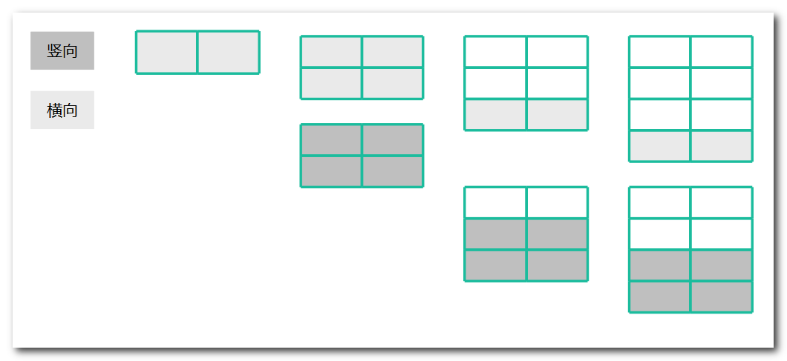
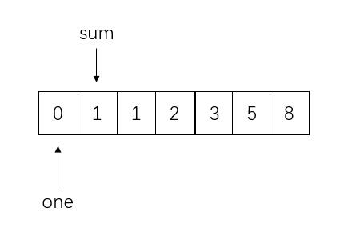
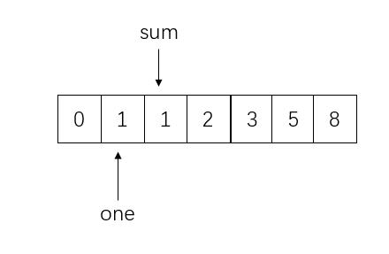
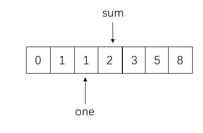
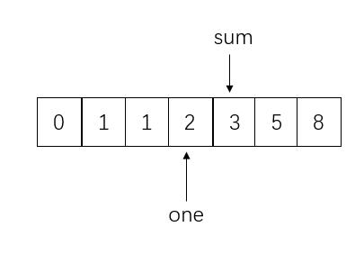
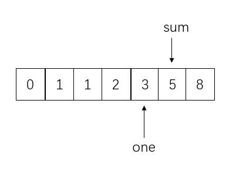

# 牛客网编程题

## 较难

### 二维数组中的查找

在一个二维数组中（每个一维数组的长度相同），每一行都按照从左到右递增的顺序排序，每一列都按照从上到下递增的顺序排序。请完成一个函数，输入这样的一个二维数组和一个整数，判断数组中是否含有该整数。

```java
public class Solution {
    public boolean Find(int target, int [][] array) {

    }
}
```


 

一、暴力法

1.分析

挨个遍历数组，如果找到就返回 true

```java
public class Solution {
    public boolean Find(int target, int [][] array) {
        for(int i=0;i<array.length;i++){
            for(int j=0;j<array[0].length;j++){
                if(array[i][j] == target){
                    return true;
                }
            }
        }
        return false;
    }
}
```

二、从左下找

1.分析

利用该二维数组的性质：

- 每一行都按照从左到右递增的顺序排序，
- 每一列都按照从上到下递增的顺序排序

改变个说法，即对于左下角的值 m，m 是该行最小的数，是该列最大的数
每次将 m 和目标值 target 比较：

1. 当 m < target，由于 m 已经是该行最大的元素，想要更大只有从列考虑，取值右移一位
2. 当 m > target，由于 m 已经是该列最小的元素，想要更小只有从行考虑，取值上移一位
3. 当 m = target，找到该值，返回 true

用某行最小或某列最大与 target 比较，每次可剔除一整行或一整列

```java
public class Solution {
    public boolean Find(int target, int [][] array) {
        int rows = array.length;
        if(rows == 0){
            return false;
        }
        int cols = array[0].length;
        if(cols == 0){
            return false;
        }
        // 左下
        int row = rows-1;
        int col = 0;
        while(row>=0 && col<cols){
            if(array[row][col] < target){
                col++;
            }else if(array[row][col] > target){
                row--;
            }else{
                return true;
            }
        }
        return false;
    }
}
```

3.复杂度

时间复杂度:

空间复杂度:.svg)

三、 从右上找

1.分析

和从左下找道理一样，都是因为每次判断都能**剔除一整行或一整列** 

```java
public class Solution {
    public boolean Find(int target, int [][] array) {
        int rows = array.length;
        if(rows == 0){
            return false;
        }
        int cols = array[0].length;
        if(cols == 0){
            return false;
        }
        // 右上
        int row = 0;   //注意
        int col = cols-1;    //注意
        while(row<rows && col>=0){    //注意
            if(array[row][col] < target){
                row++;        //注意
            }else if(array[row][col] > target){
                col--;      //注意
            }else{
                return true;
            }
        }
        return false;
    }
}
```

### 替换空格

请实现一个函数，将一个字符串中的每个空格替换成“%20”。例如，当字符串为We Are Happy.则经过替换之后的字符串为We%20Are%20Happy。 

```java
public class Solution {
    public String replaceSpace(StringBuffer str) {
    	
    }
}
```


1.调用自带函数

```java
public class Solution {
    public String replaceSpace(StringBuffer str) {
        return str.toString().replace(" ", "%20");
    }
}
```

2.用新的数组存

分析

当遇到 " "，就追加 "%20"，否则遇到什么追加什么  

```java
import java.util.*;
public class Solution {
    public String replaceSpace(StringBuffer str) {
        StringBuilder sb = new StringBuilder();
        for(int i=0;i<str.length();i++){
            char c = str.charAt(i);
            if(c == ' '){
                sb.append("%20");
            }else{
                sb.append(c);
            }
        }
        return sb.toString();
    }
}
```


### 从尾到头打印链表 -- Java实现

```java
/**
*    public class ListNode {
*        int val;
*        ListNode next = null;
*
*        ListNode(int val) {
*            this.val = val;
*        }
*    }
*
*/
import java.util.ArrayList;
public class Solution {
    public ArrayList<Integer> printListFromTailToHead(ListNode listNode) {
        
    }
}
```


一 非递归

1. 分析
  listNode 是链表，只能从头遍历到尾，但是输出却要求从尾到头，这是典型的"先进后出"，我们可以想到栈！
  ArrayList 中有个方法是 add(index,value)，可以指定 index 位置插入 value 值
  所以我们在遍历 listNode 的同时将每个遇到的值插入到 list 的 0 位置，最后输出 listNode 即可得到逆序链表

```java
import java.util.*;
public class Solution {
    public ArrayList<Integer> printListFromTailToHead(ListNode listNode) {
        ArrayList<Integer> list = new ArrayList<>();
        ListNode tmp = listNode;
        while(tmp!=null){
            list.add(0,tmp.val);
            tmp = tmp.next;
        }
        return list;
    }
}
```

时间复杂度:.svg)

空间复杂度:.svg)

二、递归

1. 分析
  既然非递归都实现了，那么我们也可以利用递归，借助系统的"栈"帮忙打印

2. 代码

   ```java
   import java.util.*;
   public class Solution {
       ArrayList<Integer> list = new ArrayList();
       public ArrayList<Integer> printListFromTailToHead(ListNode listNode) {
           if(listNode!=null){
               printListFromTailToHead(listNode.next);
               list.add(listNode.val);
           }
           return list;
       }
   }
   ```

   时间复杂度:.svg)

   空间复杂度:.svg)

### 正则表达式匹配

题目描述
请实现一个函数用来匹配包括'.'和'*'的正则表达式。模式中的字符'.'表示任意一个字符，而'*'表示它前面的字符可以出现任意次（包含0次）。 在本题中，匹配是指字符串的所有字符匹配整个模式。例如，字符串"aaa"与模式"a.a"和"ab*ac*a"匹配，但是与"aa.a"和"ab*a"均不匹配
题解 讨论 通过的代码笔记 纠错 收藏

```java
public class Solution {
    public boolean match(char[] str, char[] pattern)
    {
        
    }
}
```

一. 用库函数

```java
public class Solution {
    public boolean match(char[] str, char[] pattern)
    {
        return new String(str).matches(new String(pattern));
    }
}
```

二：实现

解法有很多，有非递归的写法，动态规划以及递归，感觉这个题属于难题了，能做出来即可，难度高还追求多种解法不是本菜鸟的风格。嗯，所以我选择在看懂递归代码后，做个总结。
代码思路：
首先肯定是两个指针，一个在给定字符串上动，一个在模板上动。如果匹配肯定都向后移动，但此时由于有两个特殊符号捣乱，因此比较特殊。
首先分析'.'的情况。当我们比较两个指针指的字符时，模板的字符是'.'，那么可以让两个指针同时后移。这个情况简单，就默认相等嘛。换句话说，本题只用考虑有没有'*'就可以了。

考虑'*'的相关情况情况。我们比较两个指针的字符时，如果字符串是s指针，模板是P指针指向某个字符。那么P的下一个字符不是'*'时，那么就是最普通的情况，直接都往后移一位。即s++,p++。
分析此时有'*'时，注意此时，p+1指向了一个'*'。那么我们怎么移动指针呢。

方式1：出现了'*'，而且s和p指向的都不相等，就相当于模板中'*'前面的出现了0次，此时必须让p指针向后移动2位，让模板跳过'*'即可。（对于abge和ac*mn，s指b，p指c，则让p指向m，即p+2。认为c没出现过）
方式2：出现了'*'，而且s和p指向的相等（这里的相等可以是真正的相等，也可以是'.'标记的相等）。比如abcd和ab*cf，其中s和p都指向了b。此时应该s+1和p+2。比如abbcd和ab*cf，其中s和p都指向了b。由于b出现了多次，应该不着急移动p，所以此时s+1即可。比如"cba","cb*a*a"，我也可以认为，p指向的第1个a没出现过，即使你相等。因此此时可以s不动，p+2。
可以看到，方式2中其实又分为3种情况，而实际上，我们无法区分具体应该选择哪一个方式处理，所以只能将3个方法同时利用或运算并列起来。其中方式2的第3种处理很不容易想到，因为就算相等了，我还是认为你不相等，忽略你，是真的牛。
再次捋一遍。由于把真正的相等和'.'标记的相等并成一类，就只用考虑'*'。如果不出现星号，就常规比较，常规比较肯定出现相等或者不等两类。如果出现星号，就考虑两个指针指的是否相等，不等，则p指针直接+2。两个指针相等，则有3种情况并列处理。再在这些判断中，加入对应边界条件，就可以很容易理解并写出代码了。

代码:

```java
public class Solution {
    public boolean match(char[] str, char[] pattern)
    {
        if (str == null || pattern == null)
            return false;
        return matchCore(str, 0, pattern, 0);
    }
    private boolean matchCore(char[] str, int s, char[] pattern, int p) {
        //下面4行是递归结束标志，两个指针都指到了最后，才是匹配，否则不匹配
        if (s == str.length && p == pattern.length)
            return true;
        if (s < str.length && p == pattern.length)
            return false;

        //虽然比的是P位置的，但是P后面出现*时，规则需要改变。
        if (p + 1 < pattern.length && pattern[p + 1] == '*') {
            //出现了*，并且s和P指向的相同，3种情况并列
            if ((s < str.length && pattern[p] == '.')
                    || (s < str.length && pattern[p] == str[s])) {
                return matchCore(str, s, pattern, p + 2)
                        || matchCore(str, s + 1, pattern, p)
                        || matchCore(str, s + 1, pattern, p + 2);
            } else {//出现了*，并且s和p指向的不同，那就把*前面的字符理解出现了0次，p+2
                return matchCore(str, s, pattern, p + 2);
            }
        }
        //说明P后面不是*，那么就进行常规判断。相同就分别给指针+1
        if (s < str.length && (pattern[p] == str[s] || pattern[p] == '.'))
            return matchCore(str, s + 1, pattern, p + 1);
        //p后面又不是*，也没有.给你撑腰，你还敢出现不同，那必然false
        return false;
    }
}
```

方式三:

```java
public class Solution {
    public boolean match(char[] str, char[] pattern)
    {
        //检查边界
       if(str==null||pattern==null){
           return false;
       }
        //定义两个指针分别指向str和pattern
        int indexOfStr=0;
        int indexOfPattern=0;
        return matchHelper(str,indexOfStr,pattern,indexOfPattern);
    }
 
    public boolean matchHelper(char[] str,int indexOfStr,char[] pattern,int indexOfPattern){
        //判断边界条件,指针索引完成
        if(indexOfStr==str.length&&indexOfPattern==pattern.length){
            return true;
        }
        //indexOfPattern先到尾部则匹配失败
        if(indexOfPattern==pattern.length&&indexOfStr<str.length){
            return false;
        }
        //pattern的第二个字符为'*',且第一个字符匹配,边界为模式指针未达到末尾
        if(indexOfPattern+1<pattern.length&&pattern[indexOfPattern+1]=='*'){
            if((indexOfStr!=str.length&&str[indexOfStr]==pattern[indexOfPattern])||(indexOfStr!=str.length&&pattern[indexOfPattern]=='.')){
            return matchHelper(str,indexOfStr,pattern,indexOfPattern+2)
                ||matchHelper(str,indexOfStr+1,pattern,indexOfPattern+2)
                ||matchHelper(str,indexOfStr+1,pattern,indexOfPattern);
        }else{
            //第一个字符不匹配,pattern直接移动两位
            return matchHelper(str,indexOfStr,pattern,indexOfPattern+2);
    }
        }
        //pattern的第二个字符不为'*',且第一个字符匹配
        if((indexOfStr!=str.length&&str[indexOfStr]==pattern[indexOfPattern])
           ||(indexOfStr!=str.length&&pattern[indexOfPattern]=='.')){
            return matchHelper(str,indexOfStr+1,pattern,indexOfPattern+1);
        }else{
                        //第一个字符不匹配
            return false;
        }
 
 
}
}
```


## 中等

### 重建二叉树

输入某二叉树的前序遍历和中序遍历的结果，请重建出该二叉树。假设输入的前序遍历和中序遍历的结果中都不含重复的数字。例如输入前序遍历序列{1,2,4,7,3,5,6,8}和中序遍历序列{4,7,2,1,5,3,8,6}，则重建二叉树并返回。
题解 讨论 通过的代码笔记 纠错 收藏

```java
/**
 * Definition for binary tree
 * public class TreeNode {
 *     int val;
 *     TreeNode left;
 *     TreeNode right;
 *     TreeNode(int x) { val = x; }
 * }
 */
public class Solution {
    public TreeNode reConstructBinaryTree(int [] pre,int [] in) {
        
    }
}
```

递归构建二叉树

1. 分析
  根据中序遍历和前序遍历可以确定二叉树，具体过程为：

根据前序序列第一个结点确定根结点
根据根结点在中序序列中的位置分割出左右两个子序列
对左子树和右子树分别递归使用同样的方法继续分解
例如：
前序序列{1,2,4,7,3,5,6,8} = pre
中序序列{4,7,2,1,5,3,8,6} = in

根据当前前序序列的第一个结点确定根结点，为 1
找到 1 在中序遍历序列中的位置，为 in[3]
切割左右子树，则 in[3] 前面的为左子树， in[3] 后面的为右子树
则切割后的左子树前序序列为：{2,4,7}，切割后的左子树中序序列为：{4,7,2}；切割后的右子树前序序列为：{3,5,6,8}，切割后的右子树中序序列为：{5,3,8,6}
对子树分别使用同样的方法分解

代码

```java
/**
 * Definition for binary tree
 * public class TreeNode {
 *     int val;
 *     TreeNode left;
 *     TreeNode right;
 *     TreeNode(int x) { val = x; }
 * }
 */
import java.util.Arrays;
public class Solution {
    public TreeNode reConstructBinaryTree(int [] pre,int [] in) {
        if (pre.length == 0 || in.length == 0) {
            return null;
        }
        TreeNode root = new TreeNode(pre[0]);
        // 在中序中找到前序的根
        for (int i = 0; i < in.length; i++) {
            if (in[i] == pre[0]) {
                // 左子树，注意 copyOfRange 函数，左闭右开
                root.left = reConstructBinaryTree(Arrays.copyOfRange(pre, 1, i + 1), Arrays.copyOfRange(in, 0, i));
                // 右子树，注意 copyOfRange 函数，左闭右开
                root.right = reConstructBinaryTree(Arrays.copyOfRange(pre, i + 1, pre.length), Arrays.copyOfRange(in, i + 1, in.length));
                break;
            }
        }
        return root;
    }
}
```

时间复杂度:.svg)

空间复杂度:.svg)

### 跳台阶

一只青蛙一次可以跳上1级台阶，也可以跳上2级。求该青蛙跳上一个n级的台阶总共有多少种跳法（先后次序不同算不同的结果）。 

```java
public class Solution {
    public int JumpFloor(int target) {

    }
}
```

题目解析
这是一道经典的递推题目，你可以想如果青蛙当前在第n级台阶上，那它上一步是在哪里呢？

显然，由于它可以跳1级台阶或者2级台阶，所以它上一步必定在第n-1,或者第n-2级台阶，也就是说它跳上n级台阶的跳法数是跳上n-1和跳上n-2级台阶的跳法数之和。

设跳上 i 级台阶有 f(n) 种跳法 , 则他跳上n级台阶有 f(n) = f(n-1) + f(n-2)种跳法 然后，我们又思考初始 (n-2<=0)的情况，跳上1级台阶只有1种跳法，跳上2级台阶有2种跳法，
最终我们得到如下的递推式：


这个递推式和 Fibonacci 比较相似

这里就简单写常用的两种实现方式，详情可以参考上篇博客解法：斐波那契数列（四种解法）。

方法一：
面试别写型递推版实现，时间复杂度:2的n次方

```java
public class Solution {
    public int JumpFloor(int n) {
        if (n == 1) return 1; 
        if (n == 2) return 2;
        return JumpFloor(n - 1) + JumpFloor(n - 2);
    }
}
```

方法二：
面试推荐型，自底向上型循环求解，时间复杂度为 O(n)

```java
public class Solution {
    public int JumpFloor(int target) {
        int a = 1, b = 1;
        for (int i = 1; i < target; i++) {
            a = a + b;
            b = a - b;
        }
        return a;
    }
}
```

### 矩形覆盖

题目描述
我们可以用2*1的小矩形横着或者竖着去覆盖更大的矩形。请问用n个2*1的小矩形无重叠地覆盖一个2*n的大矩形，总共有多少种方法？

比如n=3时，2*3的矩形块有3种覆盖方法：


```java
public class Solution {
    public int RectCover(int target) {

    }
}
```


迭代:

涂掉最后一级矩形的时候，是用什么方式完成的？

n = 1 的时候
只能横着覆盖，一种
n = 2 的时候
可以横着和竖着覆盖，两种
n = 3 的时候
第三级横着覆盖，用了一级，剩下 n = 2，有两种覆盖方法
第三季竖着覆盖，用了两级，剩下 n = 1，有一种覆盖方法
总共有 3 种
n = 4 的时候
第 4 级横着覆盖，用了一级，剩下 n = 3，有三种覆盖方法
第 4 级竖着覆盖，用了两级，剩下 n = 2，有两种覆盖方法
总共有 5 种方法
n = n 的时候
第 n 级横着覆盖，用了一级，剩下 n = n - 1，所以关注第 n - 1 种有几种覆盖方法
第 n 级竖着覆盖，用了两级，剩下 n = n - 2，所以关注第 n - 2 种有几种覆盖方法
总和为两种情况的总和
从 n = 1 到 n = 4 的示意图如下：





所以回答上面的问题，涂掉最后一级矩阵的时候，可以选择使用横向完成，也可以使用竖向完成，横向涂剩下 n - 1 阶，竖向涂剩下 n - 2 阶

关注 n - 1 与 n - 2 时的涂法有几种，这就是斐波那契数列

```java
public class Solution {
    public int RectCover(int target) {
        if (target <= 2){
            return target;
        }
        int pre1 = 2; // n 最后使用一块，剩下 n-1 块的写法
        int pre2 = 1; // n 最后使用两块，剩下 n-2 块的写法
        for (int i = 3; i <= target; i++){
            int cur = pre1 + pre2;
            pre2 = pre1;
            pre1 = cur;
        }
        return pre1; //相对于 n+1 块来说，第 n 种的方法
    }
}
```


## 简单

### 用两个栈实现队列

用两个栈来实现一个队列，完成队列的Push和Pop操作。 队列中的元素为int类型。  

```java
import java.util.Stack;

public class Solution {
    Stack<Integer> stack1 = new Stack<Integer>();
    Stack<Integer> stack2 = new Stack<Integer>();

    public void push(int node) {
        
    }
    
    public int pop() {
    
    }
}

```

1.分析

队列的特性是：“先入先出”，栈的特性是：“先入后出”

当我们向模拟的队列插入数 a,b,c 时，假设插入的是 stack1，此时的栈情况为：

栈 stack1：{a,b,c}
栈 stack2：{}
当需要弹出一个数，根据队列的"先进先出"原则，a 先进入，则 a 应该先弹出。但是此时 a 在 stack1 的最下面，将 stack1 中全部元素逐个弹出压入 stack2，现在可以正确的从 stack2 中弹出 a，此时的栈情况为：

栈 stack1：{}
栈 stack2：{c,b}
继续弹出一个数，b 比 c 先进入"队列"，b 弹出，注意此时 b 在 stack2 的栈顶，可直接弹出，此时的栈情况为：

栈 stack1：{}
栈 stack2：{c}
此时向模拟队列插入一个数 d，还是插入 stack1，此时的栈情况为：

栈 stack1：{d}
栈 stack2：{c}
弹出一个数，c 比 d 先进入，c 弹出，注意此时 c 在 stack2 的栈顶，可直接弹出，此时的栈情况为：

栈 stack1：{d}
栈 stack2：{c}
根据上述栗子可得出结论：

当插入时，直接插入 stack1
当弹出时，当 stack2 不为空，弹出 stack2 栈顶元素，如果 stack2 为空，将 stack1 中的全部数逐个出栈入栈 stack2，再弹出 stack2 栈顶元素

代码

```java
import java.util.Stack;
public class Solution {
    Stack<Integer> stack1 = new Stack<Integer>();
    Stack<Integer> stack2 = new Stack<Integer>();

    public void push(int node) {
        stack1.push(node);
    }

    public int pop() {
        if (stack2.size() <= 0) {
            while (stack1.size() != 0) {
                stack2.push(stack1.pop());
            }
        }
        return stack2.pop();
    }
}
```


复杂度:

push时间复杂度：O(1)
pop空间复杂度：O(1)

### 旋转数组的最小数字

题目描述:

把一个数组最开始的若干个元素搬到数组的末尾，我们称之为数组的旋转。 输入一个非递减排序的数组的一个旋转，输出旋转数组的最小元素。 例如数组[3,4,5,1,2]为[1,2,3,4,5]的一个旋转，该数组的最小值为1。 NOTE：给出的所有元素都大于0，若数组大小为0，请返回0。 

```java
import java.util.ArrayList;
public class Solution {
    public int minNumberInRotateArray(int [] array) {
    
    }
}
```

方法一：遍历数组，不断去更新保存最小值的变量。时间复杂度是O(n)

```java
    public int minNumberInRotateArray(int [] array) {
        if (array.length == 0) {
            return 0;
        }
        int ans = array[0];
        for (int i = 1; i < array.length; i++) {
            ans = Math.min(ans, array[i]);
        }
        return ans;
    }
```

方法二：通过二分的方法，不断去更新存在于两个子数组(两个非递减排序子数组)中的下标。时间复杂度是O(log(n))

```java
 public int minNumberInRotateArray(int[] array) {
        if (array.length == 0) {
            return 0;
        }
        int l = 0;
        int r = array.length - 1;
        while (l < r - 1) {
            int mid = (l + r) >> 1;
            if (array[mid] >= array[l]) {
                l = mid; /// 说明mid所在的位置是在第一个非递减子数组中
            } else if (array[mid] <= array[r]) {
                r = mid; /// 说明mid所在的位置是在第二个非递减子数组中
            }
        }
        return array[r];
    }
```

最笨法:

```java
import java.util.ArrayList;
public class Solution {
    public int minNumberInRotateArray(int [] array) {
        if(array==null||array.length==0) return 0;
        for(int i=0;i<array.length;i++){
            if(array[i]>array[i+1]){
                return array[i+1];
            }
        }
        return array[0];


    }
}
```


### 斐波那契数列

描述

大家都知道斐波那契数列，现在要求输入一个整数n，请你输出斐波那契数列的第n项（从0开始，第0项为0，第1项是1）。

n<=39


```java
public class Solution {
    public int Fibonacci(int n) {

    }
}
```


一 递归法

斐波那契数列的标准公式为：F(1)=1，F(2)=1, F(n)=F(n-1)+F(n-2)（n>=3，n∈N*） 根据公式可以直接写出： 

```java
public class Solution {
    public int Fibonacci(int n) {
        if(n<=1){
            return n;
        }
        return Fibonacci(n-1) + Fibonacci(n-2);
    }
}
```

时间复杂度 ：.svg)

空间复杂度:.svg)

二.优化递归

分析:

递归会重复计算大量相同数据，我们用个数组把结果存起来8！

 代码

```java
public class Solution {
    public int Fibonacci(int n) {
        int ans[] = new int[40];
        ans[0] = 0;
        ans[1] = 1;
        for(int i=2;i<=n;i++){
            ans[i] = ans[i-1] + ans[i-2];
        }
        return ans[n];
    }
}
```

.复杂度:

时间复杂度:O(n)

空间复杂度:O(n)

三 优化存储:

其实我们可以发现每次就用到了最近的两个数，所以我们可以只存储最近的两个数

sum 存储第 n 项的值
one 存储第 n-1 项的值
two 存储第 n-2 项的值


代码:

```java
public class Solution {
    public int Fibonacci(int n) {
        if(n == 0){
            return 0;
        }else if(n == 1){
            return 1;
        }
        int sum = 0;
        int two = 0;
        int one = 1;
        for(int i=2;i<=n;i++){
            sum = two + one;
            two = one;
            one = sum;
        }
        return sum;
    }
}
```

复杂度:

时间复杂度:O(n)

空间复杂度:.svg)


四 . 持续优化

1.分析

观察上一版发现，sum 只在每次计算第 n 项的时候用一下，其实还可以利用 sum 存储第 n-1 项，例如当计算完 f(5) 时 sum 存储的是 f(5) 的值，当需要计算 f(6) 时，f(6) = f(5) + f(4)，sum 存储的 f(5)，f(4) 存储在 one 中，由 f(5)-f(3) 得到 如图： 











```java
public class Solution {
    public int Fibonacci(int n) {
        if(n == 0){
            return 0;
        }else if(n == 1){
            return 1;
        }
        int sum = 1;
        int one = 0;
        for(int i=2;i<=n;i++){
            sum = sum + one;
            one = sum - one;
        }
        return sum;
    }
}
```

时间复杂度:O（n）

空间复杂度:O(1)


### 变态跳台阶

一只青蛙一次可以跳上1级台阶，也可以跳上2级……它也可以跳上n级。求该青蛙跳上一个n级的台阶总共有多少种跳法。 

```java
public class Solution {
    public int JumpFloorII(int target) {
        
    }
}
```

数学问题，一行代码即可

易知

f(n)=f(n-1)+f(n-2)+……f(1)
f(n-1)=f(n-2)+……f(1)

两式相减得 

f(n)=2f(n-1)

而

f(1) = 1

所以 

f(n) = pow(2, n - 1)

由此得出： 

```java
public class Solution {
  public int JumpFloorII(int target) {
    return target <= 0 ? 0 : 1 << (target - 1);
  }
}
```


解法2

迭代

本质上是斐波那契数列的变种，普通跳台阶是一步与两步，问题规模缩小到分成最后要跳到第 n 阶可以跳两次或者一次去求解，所以，在普通跳台阶，设置两个临时变量存下跳一次或者两次时，前面会有多少种可能的结果

dp 就是可以由什么状态推导出最后的状态，斐波那契数列是由前两种状态，而这里就是由前 n - 1 种状态推导出

这里用同一个套路来分析一下

- 若楼梯阶级 n = 3

  - 跳 3 步到 3：没有剩下步数没跳的，只有这样一种跳法
  - 跳 2 步到 3：剩下的是第一步没跳，起始跳到第一步只有一种
  - 跳 1 步到 3：剩下的是第二步没跳，起始跳到第二步有两种

  求得，n = 3 时，有 4 种跳法

- 若楼梯阶级 n = 4

  - 跳 4 步到 4：没有剩下步数没跳的，只有这样一种跳法
  - 跳 3 步到 4：剩下的是第一步没跳，起始跳到第一步只有一种
  - 跳 2 步到 4：剩下的是第二步没跳，起始跳到第二步只有两种
  - 跳 1 步到 4：剩下的是第三步没跳，起始跳到第三步有四种

  求得，n = 4 时，有 8 种跳法

- 若楼梯阶级 n = n

  - 跳 x 步到 n 有几种的和，跟前 n - 1 种状态有关

那么，设置一个数组即可，在求的过程中把值都暂时放在数组里，最后求的时候遍历数据这些求好的对应的阶级种数之和即为新的下级阶梯种数

```java
import java.util.*;
public class Solution {
    public int JumpFloorII(int target) {
        if (target <= 2) {
            return target;
        }
        int[] dp = new int[target + 1];
        Arrays.fill(dp, 1); //初始化每一种都可以直接从 0 跳到 n
        dp[0] = 0; //从 0 跳到 0 为 0 种，因为 n = 0，没法跳
        for (int i = 2; i <= target; i++) {
            for (int j = i - 1; j >= 1; j--) {
                dp[i] += dp[j]; //第 n 个状态是由前 n - 1 种状态推导出来，就是累加！
            }
        }
        return dp[target];
    }
}
```


